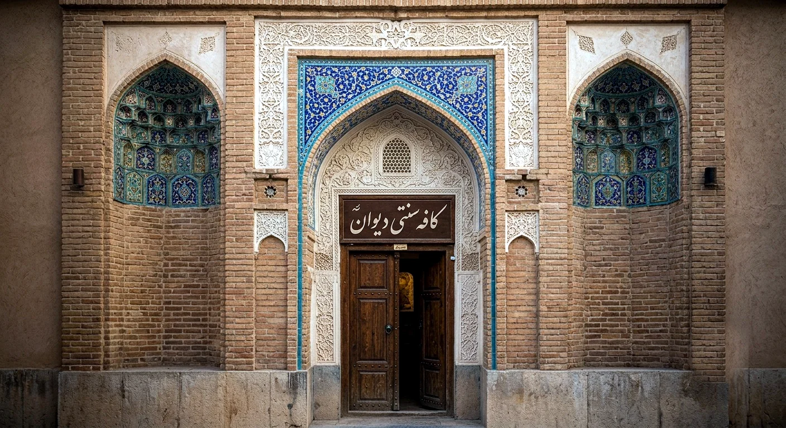

<div align="center">



# Divan — دیوان

**A bilingual (Persian/English) coffeehouse & kitchen website**
*Next.js 14 · TypeScript · Tailwind CSS · full RTL/LTR support*

[](#-testing)
[](https://nextjs.org)
[](https://www.typescriptlang.org)
[](https://tailwindcss.com)

**[🇬🇧 English](#-english)** · **[🇮🇷 فارسی](#-فارسی)**

</div>

---

## 🇬🇧 English

Divan is a from-scratch, fully bilingual café website — not a template. Every
design decision (a "ledger / ticket" menu system, a coffee-ring stamp motif,
custom ink/parchment/copper/gold color tokens) exists to give it an identity
of its own, in both Persian (RTL) and English (LTR), pixel-for-pixel.

### ✨ Features

- **93 menu items** across 6 categories — coffee & espresso, tea, cold
  drinks, breakfast, pastry, and a full Persian main-course menu (khoresh
  stews, polo rice dishes, kabab, ash/soup, and sweets) — each with bilingual
  name/description, price, and photography.
- **Cart & ordering** — add-to-cart, quantity control, and a persistent cart
  (survives a refresh) with a dedicated cart page and quick-view modal.
- **Light & dark themes**, flicker-free on first paint, synced across every
  open tab.
- **Full RTL/LTR routing** — `/fa` and `/en`, with direction, typography, and
  spacing that actually mirror correctly (not just a flipped stylesheet).
- **Off-canvas mobile navigation** and a floating, responsive header that
  adapts across phone, tablet, and desktop breakpoints.
- **Spaces gallery** — interior, courtyard, glass roastery, and reading-corner
  photo sets, each with its own detail page.
- **155 unit/component tests** with Jest + Testing Library, covering data
  integrity, i18n, cart logic, and UI behavior.

### 🛠 Stack

| | |
|---|---|
| Framework | Next.js 14 (App Router, static generation) |
| Language | TypeScript (strict mode) |
| Styling | Tailwind CSS — custom design tokens (see `tailwind.config.ts`) |
| i18n | Lightweight custom implementation — no external i18n library |
| Testing | Jest + React Testing Library |
| Deployment | Vercel |

### 🚀 Getting started

```bash
npm install
npm run dev
```

Open `http://localhost:3000` — you'll land on `/fa` or `/en` based on your
browser's `Accept-Language` header.

### 📁 Project structure

```
messages/              en.json / fa.json — every piece of UI copy, per locale
src/
  app/
    [locale]/           locale-scoped routes: /, /menu, /about, /contact,
                         /cart, /spaces/[key]
    layout.tsx           root passthrough layout
  components/            Header, Hero, MenuTicket, QuickViewModal,
                          MobileNav, CartView, ContactForm, Ambiance, …
  lib/
    i18n.ts               locale helpers + dictionary loader
    theme.ts               light/dark theme resolution (FOUC-safe)
    utils.ts                cn(), formatPrice(), ledgerNumber()
    data.ts                  menu items, categories, gallery, spaces, stats
__tests__/              Jest suites, mirroring the src/ structure
public/
  menu-photos/           per-dish photography (WebP, 480×480)
  gallery-photos/         hero + gallery preview shots
  space-photos/            full photo sets for each "space" detail page
```

### ✅ Testing

```bash
npm test          # run once
npm run test:watch
```

Every new piece of logic — pure helpers, i18n resolution, cart/reducer
behavior, data-integrity checks (unique IDs, valid categories, on-disk photo
existence), and component behavior in both locales — has test coverage.

### 📝 Editorial content

- Menu items, prices (in Toman), categories, and stats live in
  `src/lib/data.ts` — edit this file to update the menu.
- All UI strings live in `messages/en.json` and `messages/fa.json`, keyed
  identically so both stay in sync.
- Photography lives under `public/menu-photos`, `public/gallery-photos`, and
  `public/space-photos` — drop in a new WebP and reference it via
  `localPhoto` in `data.ts`.

### ☁️ Deploying to Vercel

1. Push this project to a GitHub/GitLab/Bitbucket repo.
2. In Vercel, **Add New Project** → import the repo. Framework preset
   `Next.js` is auto-detected — no config changes needed.
3. Deploy. Vercel runs `npm install && npm run build` automatically.
4. Add a custom domain under **Settings → Domains** once deployed.

No environment variables are required — there's no database or backend. The
contact form is a static UI stub; wire its `handleSubmit` in
`src/components/ContactForm.tsx` to an API route or a service like
Formspree/Resend when you're ready to receive real submissions.

```bash
# Vercel CLI, alternative to the dashboard flow
npm i -g vercel
vercel
vercel --prod
```

---

## 🇮🇷 فارسی

دیوان یک وب‌سایت کاملاً دو زبانه برای کافه است — از صفر ساخته شده، نه یک
قالب آماده. هر تصمیم طراحی (سیستم منوی «دفترچه‌ای/فیش‌مانند»، نشان حلقه‌ی
قهوه، و پالت رنگی اختصاصی جوهر/کاغذ/مسی/طلایی) برای این بوده که هم در فارسی
(راست‌به‌چپ) و هم در انگلیسی (چپ‌به‌راست)، پیکسل‌به‌پیکسل، هویت مستقل خودش
را داشته باشد.

### ✨ امکانات

- **۹۳ آیتم منو** در ۶ دسته‌بندی — قهوه و اسپرسو، دمنوش و چای، نوشیدنی سرد،
  صبحانه، شیرینی و دسر، و یک منوی کامل غذای اصلی ایرانی (انواع خورش، پلو،
  کباب، آش) — هرکدام با نام و توضیح دوزبانه، قیمت، و عکس اختصاصی.
- **سبد خرید و سفارش** — افزودن به سبد، کنترل تعداد، و سبدی که حتی بعد از
  رفرش صفحه هم باقی می‌ماند، همراه با صفحه‌ی اختصاصی سبد و پیش‌نمایش سریع.
- **حالت روشن و تاریک**، بدون پرش/چشمک در بارگذاری اول، و هماهنگ بین همه‌ی
  تب‌های باز.
- **مسیریابی کامل راست‌به‌چپ/چپ‌به‌راست** — `/fa` و `/en`، با جهت، تایپوگرافی
  و فاصله‌گذاری که واقعاً به‌درستی آینه می‌شوند (نه فقط استایل‌شیت برعکس‌شده).
- **منوی موبایل آف‌کنواس** و یک هدر شناور واکنش‌گرا که بین موبایل، تبلت و
  دسکتاپ به‌درستی خودش را تطبیق می‌دهد.
- **گالری فضاهای کافه** — فضای داخلی، حیاط مرکزی، رست‌خانه‌ی شیشه‌ای و
  گوشه‌ی کتاب، هرکدام با صفحه‌ی جزئیات و مجموعه‌ی عکس خودش.
- **۱۵۵ تست واحد/کامپوننت** با Jest و Testing Library، که یکپارچگی
  داده‌ها، ترجمه، منطق سبد خرید، و رفتار رابط کاربری را پوشش می‌دهد.

### 🛠 فناوری‌ها

| | |
|---|---|
| فریم‌ورک | Next.js 14 (App Router، تولید استاتیک) |
| زبان | TypeScript (حالت strict) |
| استایل | Tailwind CSS — توکن‌های طراحی اختصاصی (`tailwind.config.ts`) |
| چندزبانگی | پیاده‌سازی سبک اختصاصی — بدون کتابخانه‌ی i18n خارجی |
| تست | Jest + React Testing Library |
| استقرار | Vercel |

### 🚀 شروع سریع

```bash
npm install
npm run dev
```

آدرس `http://localhost:3000` را باز کنید — بر اساس هدر `Accept-Language`
مرورگرتان به `/fa` یا `/en` هدایت می‌شوید.

### ✅ تست‌ها

```bash
npm test          # یک‌بار اجرا
npm run test:watch
```

### 📝 محتوای قابل‌ویرایش

- آیتم‌های منو، قیمت‌ها (تومان)، دسته‌بندی‌ها و آمار در `src/lib/data.ts`
  قرار دارند — برای به‌روزرسانی منو همین فایل را ویرایش کنید.
- تمام متن‌های رابط کاربری در `messages/en.json` و `messages/fa.json`
  هستند، با کلیدهای یکسان تا دو زبان همیشه هماهنگ بمانند.
- عکس‌ها زیر `public/menu-photos`، `public/gallery-photos` و
  `public/space-photos` قرار دارند — یک WebP جدید اضافه کنید و در `data.ts`
  از طریق `localPhoto` به آن ارجاع دهید.

### ☁️ استقرار روی Vercel

۱. پروژه را به یک ریپوی GitHub/GitLab/Bitbucket پوش کنید.
۲. در Vercel، **Add New Project** را بزنید و ریپو را ایمپورت کنید — پریست
   `Next.js` به‌صورت خودکار تشخیص داده می‌شود.
۳. دیپلوی کنید؛ Vercel به‌صورت خودکار `npm install && npm run build` را
   اجرا می‌کند.
۴. برای دامنه‌ی اختصاصی، بعد از دیپلوی به **Settings → Domains** بروید.

هیچ متغیر محیطی‌ای لازم نیست — بدون دیتابیس و بک‌اند. فرم تماس یک UI ساده‌ی
استاتیک است؛ برای دریافت پیام واقعی، `handleSubmit` در
`src/components/ContactForm.tsx` را به یک API route یا سرویسی مثل
Formspree/Resend وصل کنید.

---

<div align="center">
<sub>Built with Next.js, TypeScript, and Tailwind CSS — ساخته‌شده با عشق به قهوه ☕</sub>
</div>
